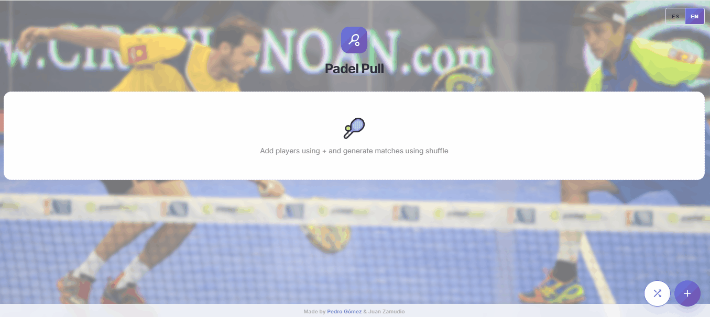

# 🎾 PadelPull: Smart Match Generator
A practical, interactive tool designed for padel organizers to mix players and generate balanced matches based on their preferred court side. This app translates complex pairing needs into a simple, visual experience.

  

---

## 🌟 The Problem & The Solution
Organizing a "Pull" or a social padel tournament is a logistical headache. Organizers often struggle to form pairs manually, leading to "court imbalance" (e.g., two pure Backhand players forced to play together). 

**PadelPull** provides immediate clarity. By managing a list of players and their specific side preferences (Drive, Backhand, or Both), the app's algorithm generates optimized matches and identifies reserves in a single click.

### 🚀 Core Features
* **Smart Side Logic:** Each player is assigned a preferred side. The algorithm considers these preferences to create realistic pairs, avoiding common court conflicts.
* **Imbalance Warning System:** If the player pool has too many "Drive" or "Backhand" players to form valid matches, the app displays a visual warning before generating, helping organizers adjust the lineup.
* **Visual Court Rendering:** Instead of a simple text list, matches are displayed as **interactive padel courts** using a clean, modern UI for better spatial visualization of the game.
* **One-Click Clipboard Export:** Once matches are generated, a "Copy" feature formats the results and reserves into a clean text block, ready to be pasted directly into WhatsApp or Telegram groups.
* **Reserves Management:** Automatically detects and lists players who aren't in the current rotation, ensuring no one is forgotten for the next round.
* **Bilingual Support:** Fully accessible in **English and Spanish**, with a persistent language toggle that updates the entire interface instantly via `i18n`.
* **Responsive Material Design:** Built with **Material UI (MUI)**, the interface is optimized for mobile use at the club, featuring a floating action button (FAB) system for quick navigation.
* **CI/CD Pipeline:** Automated build, type-check, lint, and deploy to **Firebase Hosting** on every push to main via GitHub Actions.

---

## 🧠 The Matchmaking Logic
At the heart of **PadelPull** is a custom pairing algorithm designed to mirror how real padel matches are formed, focusing on two main pillars: **Viability** and **Fairness**.

* **Preference-Aware Pairing:** Unlike random generators, PadelPull prioritizes player roles. It ensures that a "Drive" specialist is paired with a "Backhand" specialist, preventing suboptimal team compositions.
* **Polyvalence Handling:** Players marked as **"Both"** (Ambos) act as "wildcards" in the logic. The algorithm dynamically assigns them to the side that is most needed to complete a quartet, maximizing the number of active matches.
* **The "Pull" Shuffle:** To keep social tournaments engaging, the algorithm introduces a randomization layer. Even with fixed side preferences, the system shuffles available pairings to ensure users don't always play with or against the same people.
* **Imbalance Detection:** Before execution, the system runs a pre-check on the player pool. If the math doesn't add up (e.g., 5 Backhands and only 1 Drive), it triggers a **Constraint Warning**, advising the organizer that some players will have to play "out of position".
* **Automated Reserves:** If the total number of players is not a multiple of 4, the algorithm intelligently selects reserves, ensuring that the players left out are those whose positions were hardest to fit in that specific round's logic.

---

## 🧪 Reliability & Testing (Vitest + Playwright)
In a competitive tournament environment, the generator must be fail-proof. The project uses two testing layers:
* **Vitest** for unit tests on the `PadelPull` domain logic, ensuring the mixing algorithm correctly handles edge cases, odd numbers of players, and side preference distribution.
* **Playwright** for end-to-end tests covering the full user flow: adding players, toggling languages, and verifying the modal display across Chrome, Firefox, and WebKit.

---

## 🛠️ Tech Stack
* **Frontend:** `React 18`, `TypeScript`, `Material UI (MUI)`.
* **State & Logic:** Domain-driven match-making algorithm.
* **Testing:** `Vitest` for logic verification and `Playwright` for E2E coverage.
* **Localization:** `i18next` with full ES/EN support.
* **Storage:** `Local Storage` persistence for maintaining player lists between sessions.
* **CI/CD:** `GitHub Actions` + `Firebase Hosting`.

---

## ⚙️ Installation & Setup
1. **Clone the repository:**
| |git clone [https://github.com/juanzafe/padelpull.github.io]

2. **Install dependencies:**
| |npm install

3. **Run Logic tests:**
| |npm run test

4. **Run Development Mode:**
| |npm run dev

Developed by Pedro Gómez & Juan Zamudio – Real solutions for everyday professional problems.